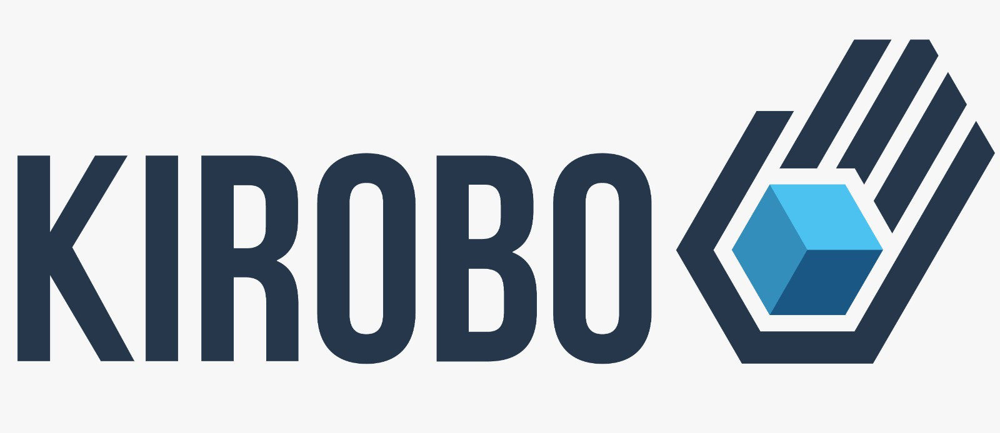

kirobo Token
===================
Overview
--------
Kirobo develops decentralized applications that bring a layer of safety to all of the most popular and lucrative activities in the cryptocurrency ecosystem. Entirely non-custodial, these tools are all provided from a single, consolidated platform – the KiVault. These services can also be used by other businesses via our API.

About this repository
---------------------
The Kirobo token **"KIRO"** is an **ERC-20** token that is used as a utility token for the specific services provided by the Kirobo.

Services of in this repository
-----------------------------------
**SafeTransfer** - decentralized, non-custodial crypto transfer platform that password-protects your transfers, and lets you undo and retrieve your funds if something isn’t right.

**P2P Swap** - away to trade assets without the need of a centralized exchange.

**staking** - staking abillity for the kiro token.

reference addresses:
--------------------
[Kiro on ethereum mainnet](https://etherscan.io/token/0xb1191f691a355b43542bea9b8847bc73e7abb137)

[Kirobo Website](https://www.kirobo.io/)